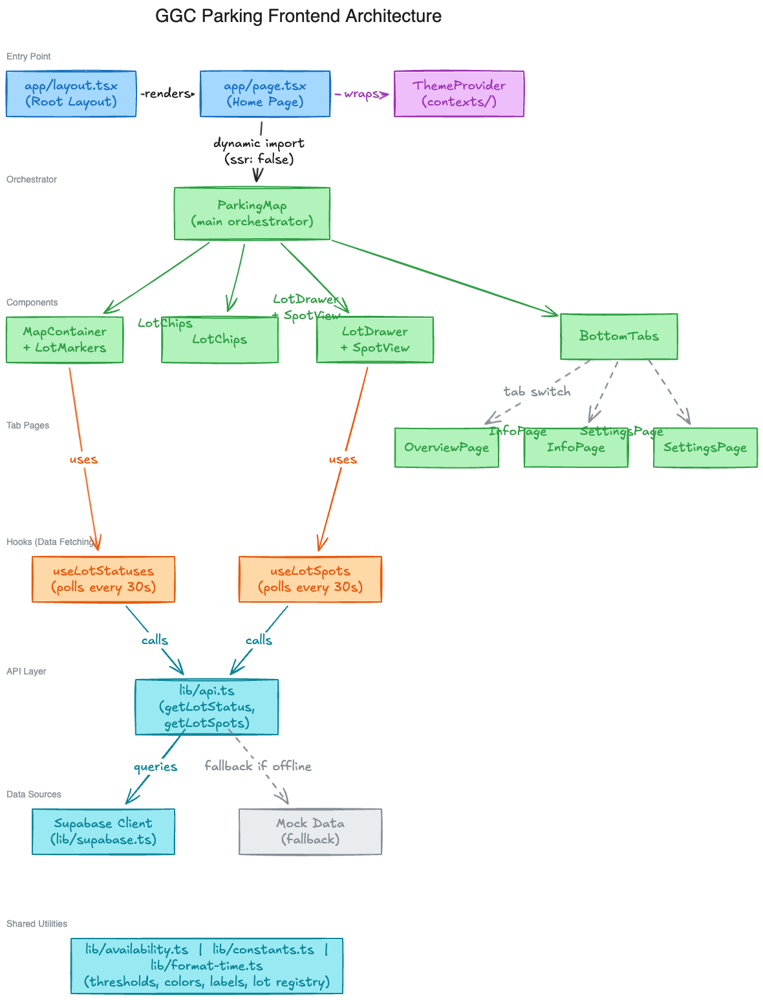

# GGC Parking Frontend

Real-time parking lot availability for Georgia Gwinnett College. A Next.js web app that displays live occupancy data on an interactive campus map, powered by a Raspberry Pi 5 running YOLO-based vehicle detection.

## Architecture

```
Pi 5 (YOLO detection) → Spring Boot API → Supabase → Next.js frontend (polls API)
```

- **Frontend:** Next.js 16, React 19, TypeScript, Tailwind CSS v4, Leaflet
- **Backend:** [Spring Boot API](https://github.com/DylanLongSE/ggc-parking-api) deployed on Railway
- **Database:** Supabase (PostgreSQL)
- **Detection:** Python + YOLO on Raspberry Pi 5

### Frontend Architecture



## Getting Started

### Prerequisites

- Node.js 20+
- npm

### Setup

```bash
git clone https://github.com/DylanLongSE/ggc-parking-frontend.git
cd ggc-parking-frontend
npm install
```

Copy `.env.example` to `.env.local` and fill in your Supabase credentials:

```bash
cp .env.example .env.local
```

### Development

```bash
npm run dev
```

Open [http://localhost:3000](http://localhost:3000) to view the app.

### Build

```bash
npm run build
npm start
```

## Testing

This project uses **Jest** and **React Testing Library** for unit/component tests, and **Playwright** for E2E tests.

### Test Structure

Tests live in `__tests__/`, mirroring the source layout:

- `__tests__/lib/` — Unit tests for utility functions
- `__tests__/components/` — Component integration tests
- `__tests__/hooks/` — Custom hook tests
- `e2e/` — Playwright E2E smoke tests

### Running Tests

```bash
# Smoke tests (fast, critical paths only)
npm run test:smoke

# Full regression suite
npm run test:regression

# Watch mode for development
npm run test:watch

# Coverage report
npm run test:coverage

# E2E tests (requires dev server running)
npm run test:e2e
```

### Smoke vs Regression

- **Smoke** (`test:smoke`): Fast tests covering core availability logic, tab navigation, data fetching, and page rendering. Run on every commit.
- **Regression** (`test:regression`): Full suite including all edge cases, loading states, boundary conditions, and component interactions. Run before merging PRs.

### CI

GitHub Actions (`.github/workflows/test.yml`) runs:
1. Smoke tests on every push/PR to main
2. Full regression + coverage if smoke passes
3. Build verification in parallel

## Deployment

The frontend is deployed on [Vercel](https://vercel.com) and auto-deploys on push to `main`.

## Generate Docs

```bash
npm run docs
```

TypeDoc output is written to `docs/` (gitignored).
